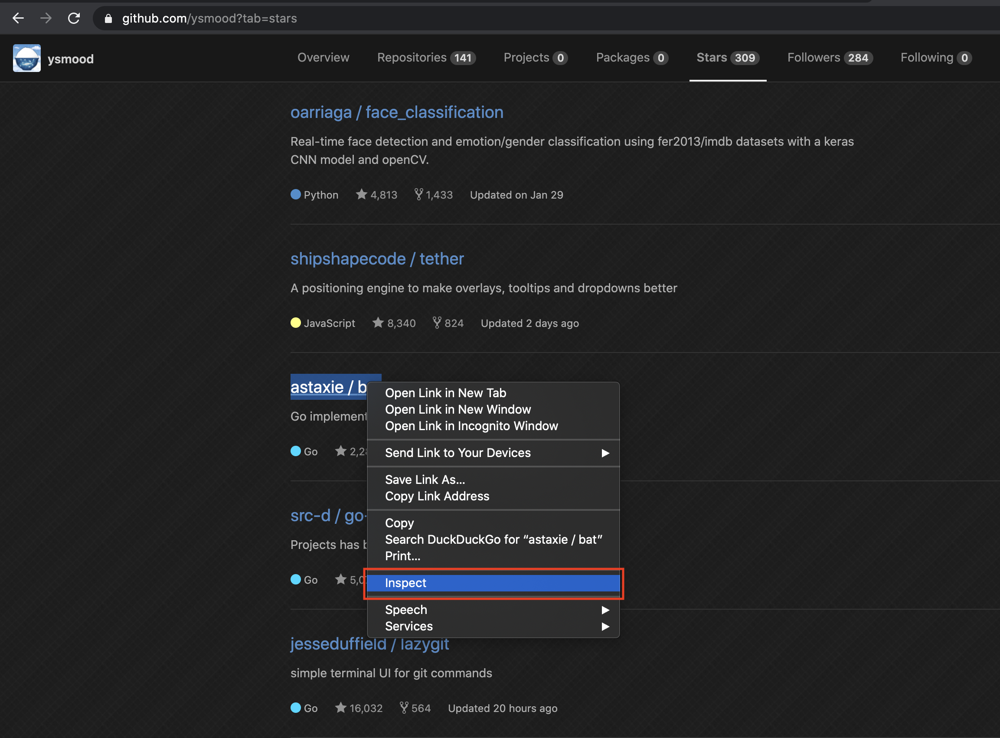
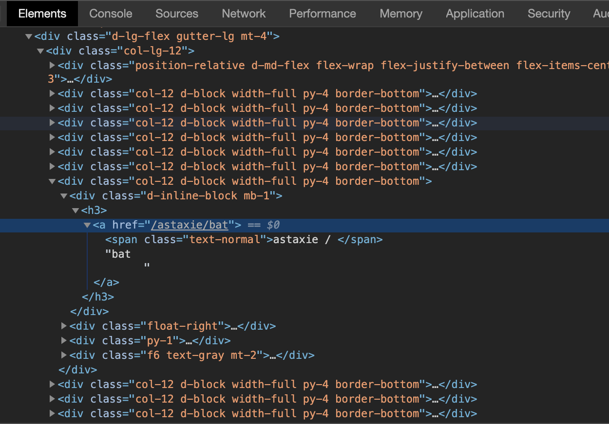

# Github Trending

This project is a tutorial for developers who want to learn basic knowledge about web scraping.
The goal is to scrape data from GitHub and rank the repositories based on the repositories you starred.

The knowledge required is just a basic understanding of coding.

To get the job done, we only need basic HTML and Golang knowledge.
This tutorial will assume you don't know anything about HTML or Golang.
If you already know them, you can skip some parts of the tutorial.

## Goal

Before we do a project, we'd better ask why we want to do it and how to measure the result, these are the compass to prevent us from getting lost.

### To Answer the Why

Github has its trending of repositories, but they are mainly based on the stars of everyone, but you are not everyone.
It would be nice to create a trending based on ourselves to help us to find more high-quality projects that fit our own needs.

### How to Measure

This trending problem can be translated as a sorting problem. We sort the repositories by their star diff then find out the top ones.

- Do the top repositories still look good after we manually read their code?

- Do the higher-ranked generally look better than the lower-ranked after we manually read their code?

It's pretty intuitive to come up with the first question, but if we don't have the second question, it's easy to design something that only works well partially.
Usually the more good measurements the better final product will be. For this tutorial, we will focus on those two.

## Design the Algorithm

How to score a repository by its quality? What will make you think a repository's quality is high?
Normally we use scores to measure the quality of things. We can try to think of a method to score repositories. Here's my idea. If we star a repository the author of it will be trustable for us. Maybe it's not 100% right but it's not bad to use it as a solution, we can optimize it later. If any author stars a repository we add a score to it, such as if 3 authors we trust stared the same repository then the repository get 3 scores. We iterate through all the authors we stared then use the scores to sort the repositories and create our personalized Github trending.

## The Approach

When doing web scraping we usually prefer to use the website's API direct to get the data we care,
but for beginners, it's usually more intuitive to scrape via the visible HTML pages. This tutorial will focus on HTML based scraping.

For the algorithm above we can use a spreadsheet to record the scores manually by repeating the action of clicking buttons and links on the pages. As long as we can find the repeat pattern of the manual actions we can automate it by programming the browser.

Let's try to find out the **Minimum Actions to Repeat** first.

1. Login the [Github](https://github.com/), then goto the stars page:
  
   

1. Choose one project in the list:

   

1. Goto the contributors page:

   

1. Choose the top contributor:

   

1. Goto the contributor's stars page:

   

1. Collect all the repositories in his or her list.

Now we just need to do the same actions to another project from step-2 again and again until we go through all the projects we stared. We add a score to a repository every time we meet it.

Very easy isn't it?

## HTML - Hypertext Markup Language

All the webpages are made of [HTML](https://en.wikipedia.org/wiki/HTML).
We need to understand it before we can automate the web actions. The good thing is that we don't have to learn how to write it, we just need to understand how to read it. So that we can tell the browser which specific button or link we want to click when we write the automation code.

HTML uses "tags" to annotate text, images, and other content for display in a Web browser.
For example if I want to render some text, the HTML will look this:

```html
<p>my text</p>
```

Here `p` is the name of the tag, it's the first letter of paragraph. The `<p>` is the open tag, the `</p>` is the close tag. Like the braces in math, open and close tags have to appear together.

Tags can be nested, such as if we want to put a button in the above paragraph, the HTML will look like this:

```html
<p>
   my text and <button>link</button>
</p>
```

The `<button>` and `<button/>` will tell the browser to render the `link` inside them as a button.

Let's read some real world HTML first. Open one page we mentioned above in your browser, right click on any link then click `inspect`:



You will see something like this:



Here 

## CSS Selector

## Golang

## Rod
